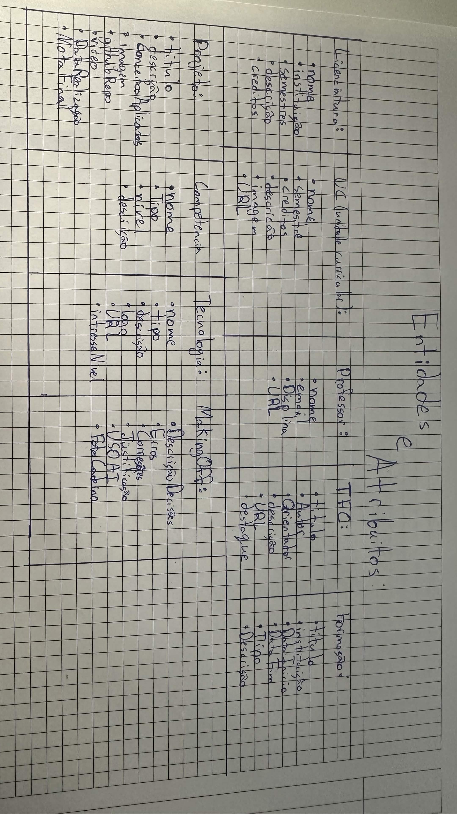
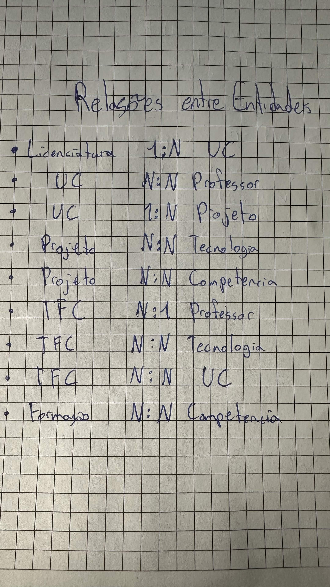
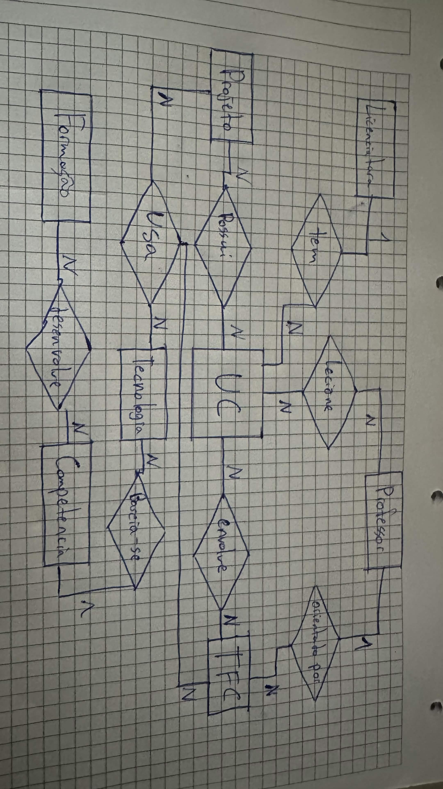

# Relatório Ficha 6

## Entidades & Atribuitos

Nesta parte Modelei as entidades associando um atribuindo os atrubuitos necessários para cada um de acordo com o enunciado e o meu próprio raciocínio.

---

## Relações entre Entidades

Nesta parte associei relaçoes entre pares de entidades de acordo com a minha experiência no tema.

## DER

A visualização das relações entre as entidades

---

## Tabelas

| Entidade               | Atributos                                                                                  |
|------------------------|--------------------------------------------------------------------------------------------|
| Licenciatura           | Nome, Instituicao, Semestres, Descricao, Creditos                                          |
| UC                     | Nome, Semestre, Descricao, Creditos, Imagem, URL                                           |
| Professor              | Nome, Email, Disciplina, URL                                                               |
| TFC                    | Título, Autor, Orientador, Descricao, URL, Destaque                                        |
| Projeto                | Titulo, Descricao, ConceitosAplicados, Imagem, GithubRepo, Video, DataRealizacao, NotaFinal|
| Tecnologia             | Nome, Tipo, Descricao, Logo, URL, InteresseNivel                                           |
| Formacao               | Titulo, Instituicao, DataInicio, DataFim, Descricao, Tipo                                  |
| Competencia            | Nome, Tipo, Nivel, Descricao                                                               |
| MakingOFF              | DescricaoDescisoes, Erros, Correcoes, Justificacao, UsoAI, FotoCaderno                     |

| Entidade 1         | Relação            | Entidade 2         | Cardinalidade        |
|--------------------|--------------------|--------------------|----------------------|
| Licenciatura       | Tem                | UC                 | 1 : N                |
| UC                 | É lecionada por    | Professor          | N : N                |
| UC                 | Contém             | Projeto            | 1 : N                |
| Projeto            | Usa                | Tecnologia         | N : N                |
| Projeto            | Possui             | Competencia        | N : N                |
| TFC                | orientado por      | Professor          | N : 1                |
| TFC                | orientado por      | Tecnologia         | N : N                |
| TFC                | Usa                | UC                 | N : N                |
| Formacao           | Desenvolve         | Competencia        | N : N                |

As tabelas foram feitas para clarificar interpertações da letra e para deixar "bonito"